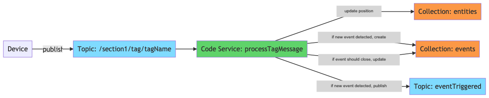

# ipm package: real-time-tracking

## Overview

Real time tracking and event detection for your IoT assets.

This is an ipm package, which contains one or more reusable assets within the ipm Community. The 'package.json' in this repo is a ipm spec's package.json, [here](https://docs.clearblade.com/v/3/6-ipm/spec), which is a superset of npm's package.json spec, [here](https://docs.npmjs.com/files/package.json).

[Browse ipm Packages](https://ipm.clearblade.com)

## Setup

Only setup required is a user with the `Administrator` role. This system includes some example assets to help get you started.

## Usage

To simulate the event detection go to the `Setup` page of the `entityTracking` portal and click the `Generate Fake Movement` button then go back to the `Home` page. Entities will move around the map and the events list will refresh as new events are detected. This is accomplished by publishing tag positions to the `section1/tag/{tagName}` which is then processed by the `processTagMessage` code service. If any rules are broken based on the event definitions a message is published on the `eventTriggered` topic.

## Assets

### Code Services

- `clearOldEvents`: remove all entries from `events` and `event_activity` collections
- `createAnchors`: creates new anchors in the `anchors` collection
- `createAreas`: creates new areas in the `areas` collection
- `createAreaTypes`: creates new area types in the `area_types` collection
- `createEntities`: creates new entities in the `entities` collection
- `createEntityTypes`: creates new entity types in the `entity_types` collection
- `createEventDefinitions`: creates new event definitions in the `event_definitions` collection
- `createEvents`: creates new events in the `events` collection
- `createTags`: creates new tags in the `tags` collection
- `createTagTypes`: creates new tag types in the `tag_types` collection
- `createUsers`: creates new users in the ClearBlade Users table
- `createViews`: creates new views in the `views` collection
- `deleteAnchors`: deletes anchors in the `anchors` collection
- `deleteAreas`: deletes areas in the `areas` collection
- `deleteAreaTypes`: deletes area types in the `area_types` collection
- `deleteEntities`: deletes entities in the `entities` collection
- `deleteEntityTypes`: deletes entity types in the `entity_types` collection
- `deleteEventDefinitions`: deletes event definitions in the `event_definitions` collection
- `deleteEvents`: deletes events in the `events` collection
- `deleteTags`: deletes tags in the `tags` collection
- `deleteTagTypes`: deletes tag types in the `tag_types` collection
- `deleteViews`: deletes views in the `views` collection
- `fetchAnchors`: fetches anchors from the `anchors` collection
- `fetchAreas`: fetches areas from the `areas` collection
- `fetchAreaTypes`: fetches area types from the `area_types` collection
- `fetchEntities`: fetches entities from the `entities` collection
- `fetchEntityTypes`: fetches entity types from the `entity_types` collection
- `fetchEventActivity`: fetches event activity from the `event_activity` collection
- `fetchEventDefinitions`: fetches event definitions from the `event_definitions` collection
- `fetchEventDefinitionTypes`: fetches event definition types from the `event_definition_types` collection
- `fetchEvents`: fetches events from the `events` collection
- `fetchTags`: fetches tags from the `tags` collection
- `fetchTagTypes`: fetches tag types from the `tag_types` collection
- `fetchViews`: fetches views from the `views` collection
- `generateFakeMovement`: publishes a message to the `section1/tag/+` for every topic on a 500ms interval to simulate moving sensors
- `getEntityMessageHistory`: pulls message history from the `entity/position/{entity_id}` topic
- `processTagMessage`: triggered on publish to `+/tag/+` topic. responsible for creating events if a rule is broken
- `processTagMessageLRS`: long running service version of `processTagMessage`. should be used over `processTagMessage` in performance intensive situations
- `restartProcessTagMessageLRS`: stops and starts the `processTagMessageLRS` code service
- `test_createOrEndEvent`: unit test for `createOrEndEvent` code library
- `test_isAreaEvent`: unit test for `isAreaEvent` code library
- `test_isPointInPolygon`: unit test for `isPointInPolygon` code library
- `test_isProximityEvent`: unit test for `isProximityEvent` code library
- `test_shouldCreateOrEndEvent`: unit test for `createOrEndEvent` code library
- `updateAnchors`: updates anchors in the `anchors` collection
- `updateAreas`: updates areas in the `areas` collection
- `updateAreaTypes`: updates area types in the `area_types` collection
- `updateEntities`: updates entities in the `entities` collection
- `updateEntityTypes`: updates entity types in the `entity_types` collection
- `updateEventDefinitions`: updates event definitions in the `event_definitions` collection
- `updateEvents`: updates events in the `events` collection
- `updateTags`: updates tags in the `tags` collection
- `updateTagTypes`: updates tag types in the `tag_types` collection
- `updateUsers`: updates users in the ClearBlade Users table
- `updateViews`: updates views in the `views` collection

### Triggers

- `tagMessageTrigger`: triggers the `processTagMessage` service when messages are published to the `+/tag/+` topic

### Code Libraries

- `cbCreatePromise`: promise wrapper for creating an item in a given collection. also updates in-memory cache of collection
- `cbFetchPromise`: promise wrapper for fetching data from a given collection
- `cbUpdatePromise`: promise wrapper for updating items in a given collection. also updates in-memory cache of collection
- `chai`: used for unit tests
- `chai_subset`: used for unit tests
- `createOrEndEvent`: processes the position of an entity and creates or ends events based on event definitions. publishes on the `eventTriggered` topic
- `isAreaEvent`: determines whether or not an entity position has created an area event given the position of areas and event definitions
- `isPointInPolygon`: determines whether or not a coordinate is inside of an area
- `isProximityEvent`: determines whether or not the position of two entities should be considered a proximity event given the event definitions
- `makeName`: creates the name for an event given the entities and/or areas involved
- `QPromiseLib`: allows for promises within code libraries/services

### Collections

- `anchors`
- `areas`
- `area_types`
- `entities`
- `entity_types`
- `events`
- `event_activity`
- `event_definitions`
- `event_definition_types`
- `tags`
- `tag_types`
- `views`

### Portals

#### entityTracking

- Home Page: view entities and their positions on map. move and create/update areas on map. view active and historical events. view list of entities and areas

- Event History: view list of all events in the system. see details of individual events including start/stop time and entities/areas involved and their positions.

- Event Definitions: CRUD operations for all event definitions in the system. create area or proximity event definitions by designating the entities/areas involved and any other relevant parameters

- Area Types: CRUD operations for all area types in the system. can be used in event definitions for generic area rules

- Entity Types: CRUD operations for all entity types in the system. required when creating entities. can be used when creating event definitions for generic rules

- Entities: CRUD operations for all entities in the system. create entities by assigning an entity type and tag to them

- Users: CRUD operations for all users in the system

- Views: CRUD operations for all views in the system. create a view by uploading a base64 representation of the image and defining the physical spaces height and width in meters

- Tags: CRUD operations for all tags in the system. create tags by assigning a name and tag type to them

- Tag Types: CRUD operations for all tag types in the system

- Anchors: CRUD operations for all anchors in the system. create an anchor by assigning it to a view and giving it a physical coordinate in relation to the view in meters

- Setup: Maintenance page for restarting `processTagMessageLRS`, calling the `clearOldEvents` code service, and calling the `generateFakeMovement` code service

## API

### Functions

<dl>
<dt><a href="#cbCreatePromise">cbCreatePromise(item, collectionName, [cache])</a> ⇒ <code>Promise</code></dt>
<dd></dd>
<dt><a href="#cbFetchPromise">cbFetchPromise(collectionName, [query])</a> ⇒ <code>Promise</code></dt>
<dd></dd>
<dt><a href="#cbUpdatePromise">cbUpdatePromise(changes, [item_id], collectionName, [cache], [query])</a> ⇒ <code>Promise</code></dt>
<dd></dd>
<dt><a href="#createOrEndEvent">createOrEndEvent(eventDef, msgBody, areas, entities, eventTypes)</a> ⇒ <code>Promise</code></dt>
<dd></dd>
<dt><a href="#isAreaEvent">isAreaEvent(eventDef, msgBody, areas)</a> ⇒ <code><a href="#IsAreaEvent">Array.&lt;IsAreaEvent&gt;</a></code></dt>
<dd></dd>
<dt><a href="#isPointInPolygon">isPointInPolygon(point, polygonXY)</a> ⇒ <code>number</code></dt>
<dd></dd>
<dt><a href="#isProximityEvent">isProximityEvent(eventDef, msgBody, entities)</a> ⇒ <code><a href="#IsProximityEvent">Array.&lt;IsProximityEvent&gt;</a></code></dt>
<dd></dd>
<dt><a href="#makeName">makeName(eventDef, entity, [entity2], [area])</a> ⇒ <code>string</code></dt>
<dd></dd>
<dt><a href="#QExampleAsyncCall">QExampleAsyncCall()</a></dt>
<dd>
This is a sample service to show how to use Q.defer() in the Q Promise library
<a href="http://documentup.com/kriskowal/q#the-beginning">http://documentup.com/kriskowal/q#the-beginning</a>

</dd>
<dt><a href="#createAnchors">createAnchors(req, resp)</a></dt>
<dd>
Creates items in the &quot;anchors&quot; collection

</dd>
<dt><a href="#createAreaTypes">createAreaTypes(req, resp)</a></dt>
<dd>
Creates items in the &quot;area_types&quot; collection

</dd>
<dt><a href="#createAreas">createAreas(req, resp)</a></dt>
<dd>
Creates items in the &quot;areas&quot; collection

</dd>
<dt><a href="#createEntities">createEntities(req, resp)</a></dt>
<dd>
Creates items in the &quot;entities&quot; collection

</dd>
<dt><a href="#createEntityTypes">createEntityTypes(req, resp)</a></dt>
<dd>
Creates items in the &quot;entity_types&quot; collection

</dd>
<dt><a href="#createEventDefinitions">createEventDefinitions(req, resp)</a></dt>
<dd>
Creates items in the &quot;event_definitions&quot; collection

</dd>
<dt><a href="#createEvents">createEvents(req, resp)</a></dt>
<dd>
Creates items in the &quot;events&quot; collection

</dd>
<dt><a href="#createTagTypes">createTagTypes(req, resp)</a></dt>
<dd>
Creates items in the &quot;tag_types&quot; collection

</dd>
<dt><a href="#createTags">createTags(req, resp)</a></dt>
<dd>
Creates items in the &quot;tags&quot; collection

</dd>
<dt><a href="#createViews">createViews(req, resp)</a></dt>
<dd>
Creates items in the &quot;views&quot; collection

</dd>
<dt><a href="#deleteAnchors">deleteAnchors(req, resp)</a></dt>
<dd>
Deletes items from the &quot;anchors&quot; collection

</dd>
<dt><a href="#deleteAreaTypes">deleteAreaTypes(req, resp)</a></dt>
<dd>
Deletes items from the &quot;area_types&quot; collection

</dd>
<dt><a href="#deleteAreas">deleteAreas(req, resp)</a></dt>
<dd>
Deletes items from the &quot;areas&quot; collection

</dd>
<dt><a href="#deleteEntities">deleteEntities(req, resp)</a></dt>
<dd>
Deletes items from the &quot;entities&quot; collection

</dd>
<dt><a href="#deleteEntityTypes">deleteEntityTypes(req, resp)</a></dt>
<dd>
Deletes items from the &quot;entity_types&quot; collection

</dd>
<dt><a href="#deleteEventDefinitions">deleteEventDefinitions(req, resp)</a></dt>
<dd>
Deletes items from the &quot;event_definitions&quot; collection

</dd>
<dt><a href="#deleteEvents">deleteEvents(req, resp)</a></dt>
<dd>
Deletes items from the &quot;events&quot; collection

</dd>
<dt><a href="#deleteTagTypes">deleteTagTypes(req, resp)</a></dt>
<dd>
Deletes items from the &quot;tag_types&quot; collection

</dd>
<dt><a href="#deleteTags">deleteTags(req, resp)</a></dt>
<dd>
Deletes items from the &quot;tags&quot; collection

</dd>
<dt><a href="#deleteViews">deleteViews(req, resp)</a></dt>
<dd>
Deletes items from the &quot;views&quot; collection

</dd>
<dt><a href="#fetchAnchors">fetchAnchors(req, resp)</a></dt>
<dd>
Fetches a list of items from the &quot;anchors&quot; collection

</dd>
<dt><a href="#fetchAreaTypes">fetchAreaTypes(req, resp)</a></dt>
<dd>
Fetches a list of items from the &quot;area_types&quot; collection

</dd>
<dt><a href="#fetchAreas">fetchAreas(req, resp)</a></dt>
<dd>
Fetches a list of items from the &quot;areas&quot; collection

</dd>
<dt><a href="#fetchEntities">fetchEntities(req, resp)</a></dt>
<dd>
Fetches a list of items from the &quot;entities&quot; collection

</dd>
<dt><a href="#fetchEntityTypes">fetchEntityTypes(req, resp)</a></dt>
<dd>
Fetches a list of items from the &quot;entity_types&quot; collection

</dd>
<dt><a href="#fetchEventActivity">fetchEventActivity(req, resp)</a></dt>
<dd>
Fetches a list of items from the &quot;event_activity&quot; collection

</dd>
<dt><a href="#fetchEventDefinitionTypes">fetchEventDefinitionTypes(req, resp)</a></dt>
<dd>
Fetches a list of items from the &quot;event_definition_types&quot; collection

</dd>
<dt><a href="#fetchEventDefinitions">fetchEventDefinitions(req, resp)</a></dt>
<dd>
Fetches a list of items from the &quot;event_definitions&quot; collection

</dd>
<dt><a href="#fetchEvents">fetchEvents(req, resp)</a></dt>
<dd>
Fetches a list of items from the &quot;events&quot; collection

</dd>
<dt><a href="#fetchTagTypes">fetchTagTypes(req, resp)</a></dt>
<dd>
Fetches a list of items from the &quot;tag_types&quot; collection

</dd>
<dt><a href="#fetchTags">fetchTags(req, resp)</a></dt>
<dd>
Fetches a list of items from the &quot;tags&quot; collection

</dd>
<dt><a href="#fetchViews">fetchViews(req, resp)</a></dt>
<dd>
Fetches a list of items from the &quot;views&quot; collection

</dd>
<dt><a href="#updateAnchors">updateAnchors(req, resp)</a></dt>
<dd>
Updates an item from the &quot;anchors&quot; collection

</dd>
<dt><a href="#updateAreaTypes">updateAreaTypes(req, resp)</a></dt>
<dd>
Updates an item from the &quot;area_types&quot; collection

</dd>
<dt><a href="#updateAreas">updateAreas(req, resp)</a></dt>
<dd>
Updates an item from the &quot;areas&quot; collection

</dd>
<dt><a href="#updateEntities">updateEntities(req, resp)</a></dt>
<dd>
Updates an item from the &quot;entities&quot; collection

</dd>
<dt><a href="#updateEntityTypes">updateEntityTypes(req, resp)</a></dt>
<dd>
Updates an item from the &quot;entity_types&quot; collection

</dd>
<dt><a href="#updateEventDefinitions">updateEventDefinitions(req, resp)</a></dt>
<dd>
Updates an item from the &quot;event_definitions&quot; collection

</dd>
<dt><a href="#updateEvents">updateEvents(req, resp)</a></dt>
<dd>
Updates an item from the &quot;events&quot; collection

</dd>
<dt><a href="#updateTagTypes">updateTagTypes(req, resp)</a></dt>
<dd>
Updates an item from the &quot;tag_types&quot; collection

</dd>
<dt><a href="#updateTags">updateTags(req, resp)</a></dt>
<dd>
Updates an item from the &quot;tags&quot; collection

</dd>
<dt><a href="#updateUsers">updateUsers(req, resp)</a> ⇒ <code>string</code></dt>
<dd>
Updates a user in the Users table

</dd>
<dt><a href="#updateViews">updateViews(req, resp)</a></dt>
<dd>
Updates an item from the &quot;views&quot; collection

</dd>
</dl>

### Typedefs

<dl>
<dt><a href="#Item">Item</a></dt>
<dd></dd>
<dt><a href="#Item">Item</a></dt>
<dd></dd>
<dt><a href="#EventDefinition">EventDefinition</a></dt>
<dd></dd>
<dt><a href="#MessageBody">MessageBody</a></dt>
<dd></dd>
<dt><a href="#Coordinate">Coordinate</a></dt>
<dd></dd>
<dt><a href="#Area">Area</a></dt>
<dd></dd>
<dt><a href="#Entity">Entity</a></dt>
<dd></dd>
<dt><a href="#EventType">EventType</a></dt>
<dd></dd>
<dt><a href="#IsAreaEvent">IsAreaEvent</a></dt>
<dd></dd>
<dt><a href="#Area">Area</a></dt>
<dd></dd>
<dt><a href="#EventDefinition">EventDefinition</a></dt>
<dd></dd>
<dt><a href="#MessageBody">MessageBody</a></dt>
<dd></dd>
<dt><a href="#Coordinate">Coordinate</a></dt>
<dd></dd>
<dt><a href="#IsProximityEvent">IsProximityEvent</a></dt>
<dd></dd>
<dt><a href="#Entity">Entity</a></dt>
<dd></dd>
<dt><a href="#EventDefinition">EventDefinition</a></dt>
<dd></dd>
<dt><a href="#MessageBody">MessageBody</a></dt>
<dd></dd>
<dt><a href="#EventDefinition">EventDefinition</a></dt>
<dd></dd>
<dt><a href="#Entity">Entity</a></dt>
<dd></dd>
<dt><a href="#Area">Area</a></dt>
<dd></dd>
<dt><a href="#anchors">anchors</a> : <code>object</code></dt>
<dd></dd>
<dt><a href="#createAnchorsParams">createAnchorsParams</a> : <code>object</code></dt>
<dd></dd>
<dt><a href="#area_types">area_types</a> : <code>object</code></dt>
<dd></dd>
<dt><a href="#createAreaTypesParams">createAreaTypesParams</a> : <code>object</code></dt>
<dd></dd>
<dt><a href="#areas">areas</a> : <code>object</code></dt>
<dd></dd>
<dt><a href="#createAreasParams">createAreasParams</a> : <code>object</code></dt>
<dd></dd>
<dt><a href="#entities">entities</a> : <code>object</code></dt>
<dd></dd>
<dt><a href="#createEntitiesParams">createEntitiesParams</a> : <code>object</code></dt>
<dd></dd>
<dt><a href="#entity_types">entity_types</a> : <code>object</code></dt>
<dd></dd>
<dt><a href="#createEntityTypesParams">createEntityTypesParams</a> : <code>object</code></dt>
<dd></dd>
<dt><a href="#event_definitions">event_definitions</a> : <code>object</code></dt>
<dd></dd>
<dt><a href="#createEventDefinitionsParams">createEventDefinitionsParams</a> : <code>object</code></dt>
<dd></dd>
<dt><a href="#events">events</a> : <code>object</code></dt>
<dd></dd>
<dt><a href="#createEventsParams">createEventsParams</a> : <code>object</code></dt>
<dd></dd>
<dt><a href="#tag_types">tag_types</a> : <code>object</code></dt>
<dd></dd>
<dt><a href="#createTagTypesParams">createTagTypesParams</a> : <code>object</code></dt>
<dd></dd>
<dt><a href="#tags">tags</a> : <code>object</code></dt>
<dd></dd>
<dt><a href="#createTagsParams">createTagsParams</a> : <code>object</code></dt>
<dd></dd>
<dt><a href="#NewUser">NewUser</a></dt>
<dd></dd>
<dt><a href="#createUsersParams">createUsersParams</a> : <code>object</code></dt>
<dd></dd>
<dt><a href="#CreateEmployeeResponse">CreateEmployeeResponse</a></dt>
<dd></dd>
<dt><a href="#views">views</a> : <code>object</code></dt>
<dd></dd>
<dt><a href="#createViewsParams">createViewsParams</a> : <code>object</code></dt>
<dd></dd>
<dt><a href="#anchors">anchors</a> : <code>object</code></dt>
<dd></dd>
<dt><a href="#deleteAnchorsParams">deleteAnchorsParams</a> : <code>object</code></dt>
<dd></dd>
<dt><a href="#area_types">area_types</a> : <code>object</code></dt>
<dd></dd>
<dt><a href="#deleteAreaTypesParams">deleteAreaTypesParams</a> : <code>object</code></dt>
<dd></dd>
<dt><a href="#areas">areas</a> : <code>object</code></dt>
<dd></dd>
<dt><a href="#deleteAreasParams">deleteAreasParams</a> : <code>object</code></dt>
<dd></dd>
<dt><a href="#entities">entities</a> : <code>object</code></dt>
<dd></dd>
<dt><a href="#deleteEntitiesParams">deleteEntitiesParams</a> : <code>object</code></dt>
<dd></dd>
<dt><a href="#entity_types">entity_types</a> : <code>object</code></dt>
<dd></dd>
<dt><a href="#deleteEntityTypesParams">deleteEntityTypesParams</a> : <code>object</code></dt>
<dd></dd>
<dt><a href="#event_definitions">event_definitions</a> : <code>object</code></dt>
<dd></dd>
<dt><a href="#deleteEventDefinitionsParams">deleteEventDefinitionsParams</a> : <code>object</code></dt>
<dd></dd>
<dt><a href="#events">events</a> : <code>object</code></dt>
<dd></dd>
<dt><a href="#deleteEventsParams">deleteEventsParams</a> : <code>object</code></dt>
<dd></dd>
<dt><a href="#tag_types">tag_types</a> : <code>object</code></dt>
<dd></dd>
<dt><a href="#deleteTagTypesParams">deleteTagTypesParams</a> : <code>object</code></dt>
<dd></dd>
<dt><a href="#tags">tags</a> : <code>object</code></dt>
<dd></dd>
<dt><a href="#deleteTagsParams">deleteTagsParams</a> : <code>object</code></dt>
<dd></dd>
<dt><a href="#views">views</a> : <code>object</code></dt>
<dd></dd>
<dt><a href="#deleteViewsParams">deleteViewsParams</a> : <code>object</code></dt>
<dd></dd>
<dt><a href="#anchors">anchors</a> : <code>object</code></dt>
<dd></dd>
<dt><a href="#fetchAnchorsParams">fetchAnchorsParams</a> : <code>object</code></dt>
<dd></dd>
<dt><a href="#area_types">area_types</a> : <code>object</code></dt>
<dd></dd>
<dt><a href="#fetchAreaTypesParams">fetchAreaTypesParams</a> : <code>object</code></dt>
<dd></dd>
<dt><a href="#areas">areas</a> : <code>object</code></dt>
<dd></dd>
<dt><a href="#fetchAreasParams">fetchAreasParams</a> : <code>object</code></dt>
<dd></dd>
<dt><a href="#entities">entities</a> : <code>object</code></dt>
<dd></dd>
<dt><a href="#fetchEntitiesParams">fetchEntitiesParams</a> : <code>object</code></dt>
<dd></dd>
<dt><a href="#entity_types">entity_types</a> : <code>object</code></dt>
<dd></dd>
<dt><a href="#fetchEntityTypesParams">fetchEntityTypesParams</a> : <code>object</code></dt>
<dd></dd>
<dt><a href="#event_activity">event_activity</a> : <code>object</code></dt>
<dd></dd>
<dt><a href="#fetchEventActivityParams">fetchEventActivityParams</a> : <code>object</code></dt>
<dd></dd>
<dt><a href="#event_definition_types">event_definition_types</a> : <code>object</code></dt>
<dd></dd>
<dt><a href="#fetchEventDefinitionTypesParams">fetchEventDefinitionTypesParams</a> : <code>object</code></dt>
<dd></dd>
<dt><a href="#event_definitions">event_definitions</a> : <code>object</code></dt>
<dd></dd>
<dt><a href="#fetchEventDefinitionsParams">fetchEventDefinitionsParams</a> : <code>object</code></dt>
<dd></dd>
<dt><a href="#events">events</a> : <code>object</code></dt>
<dd></dd>
<dt><a href="#fetchEventsParams">fetchEventsParams</a> : <code>object</code></dt>
<dd></dd>
<dt><a href="#tag_types">tag_types</a> : <code>object</code></dt>
<dd></dd>
<dt><a href="#fetchTagTypesParams">fetchTagTypesParams</a> : <code>object</code></dt>
<dd></dd>
<dt><a href="#tags">tags</a> : <code>object</code></dt>
<dd></dd>
<dt><a href="#fetchTagsParams">fetchTagsParams</a> : <code>object</code></dt>
<dd></dd>
<dt><a href="#views">views</a> : <code>object</code></dt>
<dd></dd>
<dt><a href="#fetchViewsParams">fetchViewsParams</a> : <code>object</code></dt>
<dd></dd>
<dt><a href="#anchors">anchors</a> : <code>object</code></dt>
<dd></dd>
<dt><a href="#updateAnchorsParams">updateAnchorsParams</a> : <code>object</code></dt>
<dd></dd>
<dt><a href="#area_types">area_types</a> : <code>object</code></dt>
<dd></dd>
<dt><a href="#updateAreaTypesParams">updateAreaTypesParams</a> : <code>object</code></dt>
<dd></dd>
<dt><a href="#areas">areas</a> : <code>object</code></dt>
<dd></dd>
<dt><a href="#updateAreasParams">updateAreasParams</a> : <code>object</code></dt>
<dd></dd>
<dt><a href="#entities">entities</a> : <code>object</code></dt>
<dd></dd>
<dt><a href="#updateEntitiesParams">updateEntitiesParams</a> : <code>object</code></dt>
<dd></dd>
<dt><a href="#entity_types">entity_types</a> : <code>object</code></dt>
<dd></dd>
<dt><a href="#updateEntityTypesParams">updateEntityTypesParams</a> : <code>object</code></dt>
<dd></dd>
<dt><a href="#event_definitions">event_definitions</a> : <code>object</code></dt>
<dd></dd>
<dt><a href="#updateEventDefinitionsParams">updateEventDefinitionsParams</a> : <code>object</code></dt>
<dd></dd>
<dt><a href="#events">events</a> : <code>object</code></dt>
<dd></dd>
<dt><a href="#updateEventsParams">updateEventsParams</a> : <code>object</code></dt>
<dd></dd>
<dt><a href="#tag_types">tag_types</a> : <code>object</code></dt>
<dd></dd>
<dt><a href="#updateTagTypesParams">updateTagTypesParams</a> : <code>object</code></dt>
<dd></dd>
<dt><a href="#tags">tags</a> : <code>object</code></dt>
<dd></dd>
<dt><a href="#updateTagsParams">updateTagsParams</a> : <code>object</code></dt>
<dd></dd>
<dt><a href="#user">user</a> : <code>object</code></dt>
<dd></dd>
<dt><a href="#updateUsersParams">updateUsersParams</a> : <code>object</code></dt>
<dd></dd>
<dt><a href="#views">views</a> : <code>object</code></dt>
<dd></dd>
<dt><a href="#updateViewsParams">updateViewsParams</a> : <code>object</code></dt>
<dd></dd>
</dl>

### cbCreatePromise(item, collectionName, [cache]) ⇒ <code>Promise</code>

**Kind**: global function

| Param          | Type                                     |
| -------------- | ---------------------------------------- |
| item           | [<code>Item</code>](#Item)               |
| collectionName | <code>string</code>                      |
| [cache]        | <code>Object.&lt;string, Item&gt;</code> |

### cbFetchPromise(collectionName, [query]) ⇒ <code>Promise</code>

**Kind**: global function

| Param          | Type                |
| -------------- | ------------------- |
| collectionName | <code>string</code> |
| [query]        |                     |

### cbUpdatePromise(changes, [item_id], collectionName, [cache], [query]) ⇒ <code>Promise</code>

**Kind**: global function

| Param          | Type                                     |
| -------------- | ---------------------------------------- |
| changes        | <code>Object</code>                      |
| [item_id]      | <code>string</code>                      |
| collectionName | <code>string</code>                      |
| [cache]        | <code>Object.&lt;string, Item&gt;</code> |
| [query]        | <code>Object</code>                      |

### createOrEndEvent(eventDef, msgBody, areas, entities, eventTypes) ⇒ <code>Promise</code>

**Kind**: global function  
**Returns**: <code>Promise</code> - Library that creates or closes an event based on an event definition and an event

| Param      | Type                                             |
| ---------- | ------------------------------------------------ |
| eventDef   | [<code>EventDefinition</code>](#EventDefinition) |
| msgBody    | [<code>MessageBody</code>](#MessageBody)         |
| areas      | <code>Object.&lt;string, Area&gt;</code>         |
| entities   | <code>Object.&lt;string, Entity&gt;</code>       |
| eventTypes | <code>Object.&lt;string, EventType&gt;</code>    |

### isAreaEvent(eventDef, msgBody, areas) ⇒ [<code>Array.&lt;IsAreaEvent&gt;</code>](#IsAreaEvent)

**Kind**: global function

| Param    | Type                                             |
| -------- | ------------------------------------------------ |
| eventDef | [<code>EventDefinition</code>](#EventDefinition) |
| msgBody  | [<code>MessageBody</code>](#MessageBody)         |
| areas    | <code>Object.&lt;string, Area&gt;</code>         |

### isPointInPolygon(point, polygonXY) ⇒ <code>number</code>

**Kind**: global function

| Param     | Type                                                 |
| --------- | ---------------------------------------------------- |
| point     | [<code>Coordinate</code>](#Coordinate)               |
| polygonXY | [<code>Array.&lt;Coordinate&gt;</code>](#Coordinate) |

### isProximityEvent(eventDef, msgBody, entities) ⇒ [<code>Array.&lt;IsProximityEvent&gt;</code>](#IsProximityEvent)

**Kind**: global function  
**Returns**: [<code>Array.&lt;IsProximityEvent&gt;</code>](#IsProximityEvent) - Library that creates or closes an event based on an event definition and an event

| Param    | Type                                             |
| -------- | ------------------------------------------------ |
| eventDef | [<code>EventDefinition</code>](#EventDefinition) |
| msgBody  | [<code>MessageBody</code>](#MessageBody)         |
| entities | <code>Object.&lt;string, Entity&gt;</code>       |

### makeName(eventDef, entity, [entity2], [area]) ⇒ <code>string</code>

**Kind**: global function

| Param     | Type                                             |
| --------- | ------------------------------------------------ |
| eventDef  | [<code>EventDefinition</code>](#EventDefinition) |
| entity    | [<code>Entity</code>](#Entity)                   |
| [entity2] | [<code>Entity</code>](#Entity)                   |
| [area]    | [<code>Area</code>](#Area)                       |

### QExampleAsyncCall()

This is a sample service to show how to use Q.defer() in the Q Promise library
http://documentup.com/kriskowal/q#the-beginning

**Kind**: global function  

### createAnchors(req, resp)

Creates items in the "anchors" collection

**Kind**: global function

| Param      | Type                                                     |
| ---------- | -------------------------------------------------------- |
| req        | <code>Object</code>                                      |
| req.params | [<code>createAnchorsParams</code>](#createAnchorsParams) |
| resp       | <code>CbServer.Resp</code>                               |

### createAreaTypes(req, resp)

Creates items in the "area_types" collection

**Kind**: global function

| Param      | Type                                                         |
| ---------- | ------------------------------------------------------------ |
| req        | <code>Object</code>                                          |
| req.params | [<code>createAreaTypesParams</code>](#createAreaTypesParams) |
| resp       | <code>CbServer.Resp</code>                                   |

### createAreas(req, resp)

Creates items in the "areas" collection

**Kind**: global function

| Param      | Type                                                 |
| ---------- | ---------------------------------------------------- |
| req        | <code>Object</code>                                  |
| req.params | [<code>createAreasParams</code>](#createAreasParams) |
| resp       | <code>CbServer.Resp</code>                           |

### createEntities(req, resp)

Creates items in the "entities" collection

**Kind**: global function

| Param      | Type                                                       |
| ---------- | ---------------------------------------------------------- |
| req        | <code>Object</code>                                        |
| req.params | [<code>createEntitiesParams</code>](#createEntitiesParams) |
| resp       | <code>CbServer.Resp</code>                                 |

### createEntityTypes(req, resp)

Creates items in the "entity_types" collection

**Kind**: global function

| Param      | Type                                                             |
| ---------- | ---------------------------------------------------------------- |
| req        | <code>Object</code>                                              |
| req.params | [<code>createEntityTypesParams</code>](#createEntityTypesParams) |
| resp       | <code>CbServer.Resp</code>                                       |

### createEventDefinitions(req, resp)

Creates items in the "event_definitions" collection

**Kind**: global function

| Param      | Type                                                                       |
| ---------- | -------------------------------------------------------------------------- |
| req        | <code>Object</code>                                                        |
| req.params | [<code>createEventDefinitionsParams</code>](#createEventDefinitionsParams) |
| resp       | <code>CbServer.Resp</code>                                                 |

### createEvents(req, resp)

Creates items in the "events" collection

**Kind**: global function

| Param      | Type                                                   |
| ---------- | ------------------------------------------------------ |
| req        | <code>Object</code>                                    |
| req.params | [<code>createEventsParams</code>](#createEventsParams) |
| resp       | <code>CbServer.Resp</code>                             |

### createTagTypes(req, resp)

Creates items in the "tag_types" collection

**Kind**: global function

| Param      | Type                                                       |
| ---------- | ---------------------------------------------------------- |
| req        | <code>Object</code>                                        |
| req.params | [<code>createTagTypesParams</code>](#createTagTypesParams) |
| resp       | <code>CbServer.Resp</code>                                 |

### createTags(req, resp)

Creates items in the "tags" collection

**Kind**: global function

| Param      | Type                                               |
| ---------- | -------------------------------------------------- |
| req        | <code>Object</code>                                |
| req.params | [<code>createTagsParams</code>](#createTagsParams) |
| resp       | <code>CbServer.Resp</code>                         |

### createViews(req, resp)

Creates items in the "views" collection

**Kind**: global function

| Param      | Type                                                 |
| ---------- | ---------------------------------------------------- |
| req        | <code>Object</code>                                  |
| req.params | [<code>createViewsParams</code>](#createViewsParams) |
| resp       | <code>CbServer.Resp</code>                           |

### deleteAnchors(req, resp)

Deletes items from the "anchors" collection

**Kind**: global function

| Param      | Type                                                     |
| ---------- | -------------------------------------------------------- |
| req        | <code>Object</code>                                      |
| req.params | [<code>deleteAnchorsParams</code>](#deleteAnchorsParams) |
| resp       | <code>CbServer.Resp</code>                               |

### deleteAreaTypes(req, resp)

Deletes items from the "area_types" collection

**Kind**: global function

| Param      | Type                                                         |
| ---------- | ------------------------------------------------------------ |
| req        | <code>Object</code>                                          |
| req.params | [<code>deleteAreaTypesParams</code>](#deleteAreaTypesParams) |
| resp       | <code>CbServer.Resp</code>                                   |

### deleteAreas(req, resp)

Deletes items from the "areas" collection

**Kind**: global function

| Param      | Type                                                 |
| ---------- | ---------------------------------------------------- |
| req        | <code>Object</code>                                  |
| req.params | [<code>deleteAreasParams</code>](#deleteAreasParams) |
| resp       | <code>CbServer.Resp</code>                           |

### deleteEntities(req, resp)

Deletes items from the "entities" collection

**Kind**: global function

| Param      | Type                                                       |
| ---------- | ---------------------------------------------------------- |
| req        | <code>Object</code>                                        |
| req.params | [<code>deleteEntitiesParams</code>](#deleteEntitiesParams) |
| resp       | <code>CbServer.Resp</code>                                 |

### deleteEntityTypes(req, resp)

Deletes items from the "entity_types" collection

**Kind**: global function

| Param      | Type                                                             |
| ---------- | ---------------------------------------------------------------- |
| req        | <code>Object</code>                                              |
| req.params | [<code>deleteEntityTypesParams</code>](#deleteEntityTypesParams) |
| resp       | <code>CbServer.Resp</code>                                       |

### deleteEventDefinitions(req, resp)

Deletes items from the "event_definitions" collection

**Kind**: global function

| Param      | Type                                                                       |
| ---------- | -------------------------------------------------------------------------- |
| req        | <code>Object</code>                                                        |
| req.params | [<code>deleteEventDefinitionsParams</code>](#deleteEventDefinitionsParams) |
| resp       | <code>CbServer.Resp</code>                                                 |

### deleteEvents(req, resp)

Deletes items from the "events" collection

**Kind**: global function

| Param      | Type                                                   |
| ---------- | ------------------------------------------------------ |
| req        | <code>Object</code>                                    |
| req.params | [<code>deleteEventsParams</code>](#deleteEventsParams) |
| resp       | <code>CbServer.Resp</code>                             |

### deleteTagTypes(req, resp)

Deletes items from the "tag_types" collection

**Kind**: global function

| Param      | Type                                                       |
| ---------- | ---------------------------------------------------------- |
| req        | <code>Object</code>                                        |
| req.params | [<code>deleteTagTypesParams</code>](#deleteTagTypesParams) |
| resp       | <code>CbServer.Resp</code>                                 |

### deleteTags(req, resp)

Deletes items from the "tags" collection

**Kind**: global function

| Param      | Type                                               |
| ---------- | -------------------------------------------------- |
| req        | <code>Object</code>                                |
| req.params | [<code>deleteTagsParams</code>](#deleteTagsParams) |
| resp       | <code>CbServer.Resp</code>                         |

### deleteViews(req, resp)

Deletes items from the "views" collection

**Kind**: global function

| Param      | Type                                                 |
| ---------- | ---------------------------------------------------- |
| req        | <code>Object</code>                                  |
| req.params | [<code>deleteViewsParams</code>](#deleteViewsParams) |
| resp       | <code>CbServer.Resp</code>                           |

### fetchAnchors(req, resp)

Fetches a list of items from the "anchors" collection

**Kind**: global function

| Param      | Type                                                                                       |
| ---------- | ------------------------------------------------------------------------------------------ |
| req        | <code>Object</code>                                                                        |
| req.params | [<code>fetchAnchorsParams</code>](#fetchAnchorsParams) \| [<code>anchors</code>](#anchors) |
| resp       | <code>CbServer.Resp</code>                                                                 |

### fetchAreaTypes(req, resp)

Fetches a list of items from the "area_types" collection

**Kind**: global function

| Param      | Type                                                                                                 |
| ---------- | ---------------------------------------------------------------------------------------------------- |
| req        | <code>Object</code>                                                                                  |
| req.params | [<code>fetchAreaTypesParams</code>](#fetchAreaTypesParams) \| [<code>area_types</code>](#area_types) |
| resp       | <code>CbServer.Resp</code>                                                                           |

### fetchAreas(req, resp)

Fetches a list of items from the "areas" collection

**Kind**: global function

| Param      | Type                                                                               |
| ---------- | ---------------------------------------------------------------------------------- |
| req        | <code>Object</code>                                                                |
| req.params | [<code>fetchAreasParams</code>](#fetchAreasParams) \| [<code>areas</code>](#areas) |
| resp       | <code>CbServer.Resp</code>                                                         |

### fetchEntities(req, resp)

Fetches a list of items from the "entities" collection

**Kind**: global function

| Param      | Type                                                                                           |
| ---------- | ---------------------------------------------------------------------------------------------- |
| req        | <code>Object</code>                                                                            |
| req.params | [<code>fetchEntitiesParams</code>](#fetchEntitiesParams) \| [<code>entities</code>](#entities) |
| resp       | <code>CbServer.Resp</code>                                                                     |

### fetchEntityTypes(req, resp)

Fetches a list of items from the "entity_types" collection

**Kind**: global function

| Param      | Type                                                                                                         |
| ---------- | ------------------------------------------------------------------------------------------------------------ |
| req        | <code>Object</code>                                                                                          |
| req.params | [<code>fetchEntityTypesParams</code>](#fetchEntityTypesParams) \| [<code>entity_types</code>](#entity_types) |
| resp       | <code>CbServer.Resp</code>                                                                                   |

### fetchEventActivity(req, resp)

Fetches a list of items from the "event_activity" collection

**Kind**: global function

| Param      | Type                                                                                                                 |
| ---------- | -------------------------------------------------------------------------------------------------------------------- |
| req        | <code>Object</code>                                                                                                  |
| req.params | [<code>fetchEventActivityParams</code>](#fetchEventActivityParams) \| [<code>event_activity</code>](#event_activity) |
| resp       | <code>CbServer.Resp</code>                                                                                           |

### fetchEventDefinitionTypes(req, resp)

Fetches a list of items from the "event_definition_types" collection

**Kind**: global function

| Param      | Type                                                                                                                                               |
| ---------- | -------------------------------------------------------------------------------------------------------------------------------------------------- |
| req        | <code>Object</code>                                                                                                                                |
| req.params | [<code>fetchEventDefinitionTypesParams</code>](#fetchEventDefinitionTypesParams) \| [<code>event_definition_types</code>](#event_definition_types) |
| resp       | <code>CbServer.Resp</code>                                                                                                                         |

### fetchEventDefinitions(req, resp)

Fetches a list of items from the "event_definitions" collection

**Kind**: global function

| Param      | Type                                                                                                                             |
| ---------- | -------------------------------------------------------------------------------------------------------------------------------- |
| req        | <code>Object</code>                                                                                                              |
| req.params | [<code>fetchEventDefinitionsParams</code>](#fetchEventDefinitionsParams) \| [<code>event_definitions</code>](#event_definitions) |
| resp       | <code>CbServer.Resp</code>                                                                                                       |

### fetchEvents(req, resp)

Fetches a list of items from the "events" collection

**Kind**: global function

| Param      | Type                                                                                   |
| ---------- | -------------------------------------------------------------------------------------- |
| req        | <code>Object</code>                                                                    |
| req.params | [<code>fetchEventsParams</code>](#fetchEventsParams) \| [<code>events</code>](#events) |
| resp       | <code>CbServer.Resp</code>                                                             |

### fetchTagTypes(req, resp)

Fetches a list of items from the "tag_types" collection

**Kind**: global function

| Param      | Type                                                                                             |
| ---------- | ------------------------------------------------------------------------------------------------ |
| req        | <code>Object</code>                                                                              |
| req.params | [<code>fetchTagTypesParams</code>](#fetchTagTypesParams) \| [<code>tag_types</code>](#tag_types) |
| resp       | <code>CbServer.Resp</code>                                                                       |

### fetchTags(req, resp)

Fetches a list of items from the "tags" collection

**Kind**: global function

| Param      | Type                                                                           |
| ---------- | ------------------------------------------------------------------------------ |
| req        | <code>Object</code>                                                            |
| req.params | [<code>fetchTagsParams</code>](#fetchTagsParams) \| [<code>tags</code>](#tags) |
| resp       | <code>CbServer.Resp</code>                                                     |

### fetchViews(req, resp)

Fetches a list of items from the "views" collection

**Kind**: global function

| Param      | Type                                                                               |
| ---------- | ---------------------------------------------------------------------------------- |
| req        | <code>Object</code>                                                                |
| req.params | [<code>fetchViewsParams</code>](#fetchViewsParams) \| [<code>views</code>](#views) |
| resp       | <code>CbServer.Resp</code>                                                         |

### updateAnchors(req, resp)

Updates an item from the "anchors" collection

**Kind**: global function

| Param      | Type                                                     |
| ---------- | -------------------------------------------------------- |
| req        | <code>Object</code>                                      |
| req.params | [<code>updateAnchorsParams</code>](#updateAnchorsParams) |
| resp       | <code>CbServer.Resp</code>                               |

### updateAreaTypes(req, resp)

Updates an item from the "area_types" collection

**Kind**: global function

| Param      | Type                                                         |
| ---------- | ------------------------------------------------------------ |
| req        | <code>Object</code>                                          |
| req.params | [<code>updateAreaTypesParams</code>](#updateAreaTypesParams) |
| resp       | <code>CbServer.Resp</code>                                   |

### updateAreas(req, resp)

Updates an item from the "areas" collection

**Kind**: global function

| Param      | Type                                                 |
| ---------- | ---------------------------------------------------- |
| req        | <code>Object</code>                                  |
| req.params | [<code>updateAreasParams</code>](#updateAreasParams) |
| resp       | <code>CbServer.Resp</code>                           |

### updateEntities(req, resp)

Updates an item from the "entities" collection

**Kind**: global function

| Param      | Type                                                       |
| ---------- | ---------------------------------------------------------- |
| req        | <code>Object</code>                                        |
| req.params | [<code>updateEntitiesParams</code>](#updateEntitiesParams) |
| resp       | <code>CbServer.Resp</code>                                 |

### updateEntityTypes(req, resp)

Updates an item from the "entity_types" collection

**Kind**: global function

| Param      | Type                                                             |
| ---------- | ---------------------------------------------------------------- |
| req        | <code>Object</code>                                              |
| req.params | [<code>updateEntityTypesParams</code>](#updateEntityTypesParams) |
| resp       | <code>CbServer.Resp</code>                                       |

### updateEventDefinitions(req, resp)

Updates an item from the "event_definitions" collection

**Kind**: global function

| Param      | Type                                                                       |
| ---------- | -------------------------------------------------------------------------- |
| req        | <code>Object</code>                                                        |
| req.params | [<code>updateEventDefinitionsParams</code>](#updateEventDefinitionsParams) |
| resp       | <code>CbServer.Resp</code>                                                 |

### updateEvents(req, resp)

Updates an item from the "events" collection

**Kind**: global function

| Param      | Type                                                   |
| ---------- | ------------------------------------------------------ |
| req        | <code>Object</code>                                    |
| req.params | [<code>updateEventsParams</code>](#updateEventsParams) |
| resp       | <code>CbServer.Resp</code>                             |

### updateTagTypes(req, resp)

Updates an item from the "tag_types" collection

**Kind**: global function

| Param      | Type                                                       |
| ---------- | ---------------------------------------------------------- |
| req        | <code>Object</code>                                        |
| req.params | [<code>updateTagTypesParams</code>](#updateTagTypesParams) |
| resp       | <code>CbServer.Resp</code>                                 |

### updateTags(req, resp)

Updates an item from the "tags" collection

**Kind**: global function

| Param      | Type                                               |
| ---------- | -------------------------------------------------- |
| req        | <code>Object</code>                                |
| req.params | [<code>updateTagsParams</code>](#updateTagsParams) |
| resp       | <code>CbServer.Resp</code>                         |

### updateUsers(req, resp) ⇒ <code>string</code>

Updates a user in the Users table

**Kind**: global function  
**Returns**: <code>string</code> - Error

| Param      | Type                                                 |
| ---------- | ---------------------------------------------------- |
| req        | <code>Object</code>                                  |
| req.params | [<code>updateUsersParams</code>](#updateUsersParams) |
| resp       | <code>CbServer.Resp</code>                           |

### updateViews(req, resp)

Updates an item from the "views" collection

**Kind**: global function

| Param      | Type                                                 |
| ---------- | ---------------------------------------------------- |
| req        | <code>Object</code>                                  |
| req.params | [<code>updateViewsParams</code>](#updateViewsParams) |
| resp       | <code>CbServer.Resp</code>                           |

### Item

**Kind**: global typedef  
**Properties**

| Name      | Type                |
| --------- | ------------------- |
| [item_id] | <code>string</code> |

### Item

**Kind**: global typedef  
**Properties**

| Name      | Type                |
| --------- | ------------------- |
| [item_id] | <code>string</code> |

### EventDefinition

**Kind**: global typedef  
**Properties**

| Name              | Type                 |
| ----------------- | -------------------- |
| item_id           | <code>string</code>  |
| threshold         | <code>number</code>  |
| is_inside         | <code>boolean</code> |
| event_type_id     | <code>string</code>  |
| [entity_type_id]  | <code>string</code>  |
| [entity_type2_id] | <code>string</code>  |

### MessageBody

**Kind**: global typedef  
**Properties**

| Name    | Type                |
| ------- | ------------------- |
| item_id | <code>string</code> |
| name    | <code>string</code> |
| x_pos   | <code>number</code> |
| y_pos   | <code>number</code> |

### Coordinate

**Kind**: global typedef  
**Properties**

| Name | Type                |
| ---- | ------------------- |
| x    | <code>number</code> |
| y    | <code>number</code> |

### Area

**Kind**: global typedef  
**Properties**

| Name        | Type                                                 |
| ----------- | ---------------------------------------------------- |
| item_id     | <code>string</code>                                  |
| coordinates | [<code>Array.&lt;Coordinate&gt;</code>](#Coordinate) |

### Entity

**Kind**: global typedef  
**Properties**

| Name           | Type                |
| -------------- | ------------------- |
| item_id        | <code>string</code> |
| name           | <code>string</code> |
| x_pos          | <code>number</code> |
| y_pos          | <code>number</code> |
| entity_type_id | <code>string</code> |

### EventType

**Kind**: global typedef  
**Properties**

| Name    | Type                |
| ------- | ------------------- |
| item_id | <code>string</code> |
| name    | <code>string</code> |

### IsAreaEvent

**Kind**: global typedef  
**Properties**

| Name    | Type                 |
| ------- | -------------------- |
| isEvent | <code>boolean</code> |

### Area

**Kind**: global typedef  
**Properties**

| Name        | Type                                                 |
| ----------- | ---------------------------------------------------- |
| item_id     | <code>string</code>                                  |
| coordinates | [<code>Array.&lt;Coordinate&gt;</code>](#Coordinate) |

### EventDefinition

**Kind**: global typedef  
**Properties**

| Name        | Type                 |
| ----------- | -------------------- |
| item_id     | <code>string</code>  |
| threshold   | <code>number</code>  |
| is_inside   | <code>boolean</code> |
| [entity_id] | <code>string</code>  |
| [area_id]   | <code>string</code>  |

### MessageBody

**Kind**: global typedef  
**Properties**

| Name    | Type                |
| ------- | ------------------- |
| item_id | <code>string</code> |
| name    | <code>string</code> |
| x_pos   | <code>number</code> |
| y_pos   | <code>number</code> |

### Coordinate

**Kind**: global typedef  
**Properties**

| Name | Type                |
| ---- | ------------------- |
| x    | <code>number</code> |
| y    | <code>number</code> |

### IsProximityEvent

**Kind**: global typedef  
**Properties**

| Name    | Type                 |
| ------- | -------------------- |
| isEvent | <code>boolean</code> |

### Entity

**Kind**: global typedef  
**Properties**

| Name           | Type                |
| -------------- | ------------------- |
| item_id        | <code>string</code> |
| name           | <code>string</code> |
| x_pos          | <code>number</code> |
| y_pos          | <code>number</code> |
| entity_type_id | <code>string</code> |

### EventDefinition

**Kind**: global typedef  
**Properties**

| Name              | Type                 |
| ----------------- | -------------------- |
| item_id           | <code>string</code>  |
| threshold         | <code>number</code>  |
| is_inside         | <code>boolean</code> |
| [event_type_id]   | <code>string</code>  |
| [entity_id]       | <code>string</code>  |
| [entity2_id]      | <code>string</code>  |
| [entity_type_id]  | <code>string</code>  |
| [entity_type2_id] | <code>string</code>  |

### MessageBody

**Kind**: global typedef  
**Properties**

| Name    | Type                |
| ------- | ------------------- |
| item_id | <code>string</code> |
| name    | <code>string</code> |
| x_pos   | <code>number</code> |
| y_pos   | <code>number</code> |

### EventDefinition

**Kind**: global typedef  
**Properties**

| Name          | Type                |
| ------------- | ------------------- |
| together_word | <code>string</code> |

### Entity

**Kind**: global typedef  
**Properties**

| Name | Type                |
| ---- | ------------------- |
| name | <code>string</code> |

### Area

**Kind**: global typedef  
**Properties**

| Name | Type                |
| ---- | ------------------- |
| name | <code>string</code> |

### anchors : <code>object</code>

**Kind**: global typedef  
**Properties**

| Name    | Type                |
| ------- | ------------------- |
| name    | <code>string</code> |
| x_pos   | <code>number</code> |
| y_pos   | <code>number</code> |
| view_id | <code>string</code> |

### createAnchorsParams : <code>object</code>

**Kind**: global typedef  
**Properties**

| Name  | Type                                           |
| ----- | ---------------------------------------------- |
| item  | [<code>anchors</code>](#anchors)               |
| items | [<code>Array.&lt;anchors&gt;</code>](#anchors) |

### area_types : <code>object</code>

**Kind**: global typedef  
**Properties**

| Name         | Type                |
| ------------ | ------------------- |
| name         | <code>string</code> |
| display_icon | <code>string</code> |

### createAreaTypesParams : <code>object</code>

**Kind**: global typedef  
**Properties**

| Name  | Type                                                 |
| ----- | ---------------------------------------------------- |
| item  | [<code>area_types</code>](#area_types)               |
| items | [<code>Array.&lt;area_types&gt;</code>](#area_types) |

### areas : <code>object</code>

**Kind**: global typedef  
**Properties**

| Name | Type                |
| ---- | ------------------- |
| name | <code>string</code> |

### createAreasParams : <code>object</code>

**Kind**: global typedef  
**Properties**

| Name  | Type                                       |
| ----- | ------------------------------------------ |
| item  | [<code>areas</code>](#areas)               |
| items | [<code>Array.&lt;areas&gt;</code>](#areas) |

### entities : <code>object</code>

**Kind**: global typedef  
**Properties**

| Name           | Type                |
| -------------- | ------------------- |
| name           | <code>string</code> |
| entity_type_id | <code>string</code> |
| x_pos          | <code>number</code> |
| y_pos          | <code>number</code> |

### createEntitiesParams : <code>object</code>

**Kind**: global typedef  
**Properties**

| Name  | Type                                             |
| ----- | ------------------------------------------------ |
| item  | [<code>entities</code>](#entities)               |
| items | [<code>Array.&lt;entities&gt;</code>](#entities) |

### entity_types : <code>object</code>

**Kind**: global typedef  
**Properties**

| Name         | Type                |
| ------------ | ------------------- |
| name         | <code>string</code> |
| display_icon | <code>string</code> |

### createEntityTypesParams : <code>object</code>

**Kind**: global typedef  
**Properties**

| Name  | Type                                                     |
| ----- | -------------------------------------------------------- |
| item  | [<code>entity_types</code>](#entity_types)               |
| items | [<code>Array.&lt;entity_types&gt;</code>](#entity_types) |

### event_definitions : <code>object</code>

**Kind**: global typedef  
**Properties**

| Name            | Type                 |
| --------------- | -------------------- |
| name            | <code>string</code>  |
| description     | <code>string</code>  |
| area_id         | <code>string</code>  |
| entity_id       | <code>string</code>  |
| entity2_id      | <code>string</code>  |
| entity_type_id  | <code>string</code>  |
| entity_type2_id | <code>string</code>  |
| is_inside       | <code>boolean</code> |
| threshold       | <code>number</code>  |
| event_type_id   | <code>string</code>  |
| updated_at      | <code>string</code>  |
| together_word   | <code>string</code>  |
| area_type_id    | <code>string</code>  |

### createEventDefinitionsParams : <code>object</code>

**Kind**: global typedef  
**Properties**

| Name  | Type                                                               |
| ----- | ------------------------------------------------------------------ |
| item  | [<code>event_definitions</code>](#event_definitions)               |
| items | [<code>Array.&lt;event_definitions&gt;</code>](#event_definitions) |

### events : <code>object</code>

**Kind**: global typedef  
**Properties**

| Name                | Type                 |
| ------------------- | -------------------- |
| event_definition_id | <code>string</code>  |
| created_at          | <code>string</code>  |
| active              | <code>boolean</code> |

### createEventsParams : <code>object</code>

**Kind**: global typedef  
**Properties**

| Name  | Type                                         |
| ----- | -------------------------------------------- |
| item  | [<code>events</code>](#events)               |
| items | [<code>Array.&lt;events&gt;</code>](#events) |

### tag_types : <code>object</code>

**Kind**: global typedef  
**Properties**

| Name | Type                |
| ---- | ------------------- |
| name | <code>string</code> |

### createTagTypesParams : <code>object</code>

**Kind**: global typedef  
**Properties**

| Name  | Type                                               |
| ----- | -------------------------------------------------- |
| item  | [<code>tag_types</code>](#tag_types)               |
| items | [<code>Array.&lt;tag_types&gt;</code>](#tag_types) |

### tags : <code>object</code>

**Kind**: global typedef  
**Properties**

| Name        | Type                |
| ----------- | ------------------- |
| name        | <code>string</code> |
| tag_type_id | <code>string</code> |
| entity_id   | <code>string</code> |

### createTagsParams : <code>object</code>

**Kind**: global typedef  
**Properties**

| Name  | Type                                     |
| ----- | ---------------------------------------- |
| item  | [<code>tags</code>](#tags)               |
| items | [<code>Array.&lt;tags&gt;</code>](#tags) |

### NewUser

**Kind**: global typedef  
**Properties**

| Name       | Type                | Description               |
| ---------- | ------------------- | ------------------------- |
| email      | <code>string</code> | Email address of new user |
| password   | <code>string</code> | Password for new user     |
| first_name | <code>string</code> |                           |
| last_name  | <code>string</code> |                           |

### createUsersParams : <code>object</code>

**Kind**: global typedef  
**Properties**

| Name  | Type                                           |
| ----- | ---------------------------------------------- |
| item  | [<code>NewUser</code>](#NewUser)               |
| items | [<code>Array.&lt;NewUser&gt;</code>](#NewUser) |

### CreateEmployeeResponse

**Kind**: global typedef  
**Properties**

| Name     | Type                |
| -------- | ------------------- |
| email    | <code>string</code> |
| password | <code>string</code> |

### views : <code>object</code>

**Kind**: global typedef  
**Properties**

| Name   | Type                |
| ------ | ------------------- |
| name   | <code>string</code> |
| icon   | <code>string</code> |
| width  | <code>number</code> |
| height | <code>number</code> |

### createViewsParams : <code>object</code>

**Kind**: global typedef  
**Properties**

| Name  | Type                                       |
| ----- | ------------------------------------------ |
| item  | [<code>views</code>](#views)               |
| items | [<code>Array.&lt;views&gt;</code>](#views) |

### anchors : <code>object</code>

**Kind**: global typedef  
**Properties**

| Name    | Type                |
| ------- | ------------------- |
| item_id | <code>string</code> |
| name    | <code>string</code> |
| x_pos   | <code>number</code> |
| y_pos   | <code>number</code> |
| view_id | <code>string</code> |

### deleteAnchorsParams : <code>object</code>

**Kind**: global typedef  
**Properties**

| Name     | Type                              |
| -------- | --------------------------------- |
| item_id  | <code>string</code>               |
| item_ids | <code>Array.&lt;string&gt;</code> |
| cbQuery  | <code>string</code>               |

### area_types : <code>object</code>

**Kind**: global typedef  
**Properties**

| Name         | Type                |
| ------------ | ------------------- |
| item_id      | <code>string</code> |
| name         | <code>string</code> |
| display_icon | <code>string</code> |

### deleteAreaTypesParams : <code>object</code>

**Kind**: global typedef  
**Properties**

| Name     | Type                              |
| -------- | --------------------------------- |
| item_id  | <code>string</code>               |
| item_ids | <code>Array.&lt;string&gt;</code> |
| cbQuery  | <code>string</code>               |

### areas : <code>object</code>

**Kind**: global typedef  
**Properties**

| Name    | Type                |
| ------- | ------------------- |
| item_id | <code>string</code> |
| name    | <code>string</code> |

### deleteAreasParams : <code>object</code>

**Kind**: global typedef  
**Properties**

| Name     | Type                              |
| -------- | --------------------------------- |
| item_id  | <code>string</code>               |
| item_ids | <code>Array.&lt;string&gt;</code> |
| cbQuery  | <code>string</code>               |

### entities : <code>object</code>

**Kind**: global typedef  
**Properties**

| Name           | Type                |
| -------------- | ------------------- |
| item_id        | <code>string</code> |
| name           | <code>string</code> |
| entity_type_id | <code>string</code> |
| x_pos          | <code>number</code> |
| y_pos          | <code>number</code> |

### deleteEntitiesParams : <code>object</code>

**Kind**: global typedef  
**Properties**

| Name     | Type                              |
| -------- | --------------------------------- |
| item_id  | <code>string</code>               |
| item_ids | <code>Array.&lt;string&gt;</code> |
| cbQuery  | <code>string</code>               |

### entity_types : <code>object</code>

**Kind**: global typedef  
**Properties**

| Name         | Type                |
| ------------ | ------------------- |
| item_id      | <code>string</code> |
| name         | <code>string</code> |
| display_icon | <code>string</code> |

### deleteEntityTypesParams : <code>object</code>

**Kind**: global typedef  
**Properties**

| Name     | Type                              |
| -------- | --------------------------------- |
| item_id  | <code>string</code>               |
| item_ids | <code>Array.&lt;string&gt;</code> |
| cbQuery  | <code>string</code>               |

### event_definitions : <code>object</code>

**Kind**: global typedef  
**Properties**

| Name            | Type                 |
| --------------- | -------------------- |
| item_id         | <code>string</code>  |
| name            | <code>string</code>  |
| description     | <code>string</code>  |
| area_id         | <code>string</code>  |
| entity_id       | <code>string</code>  |
| entity2_id      | <code>string</code>  |
| entity_type_id  | <code>string</code>  |
| entity_type2_id | <code>string</code>  |
| is_inside       | <code>boolean</code> |
| threshold       | <code>number</code>  |
| event_type_id   | <code>string</code>  |
| updated_at      | <code>string</code>  |
| together_word   | <code>string</code>  |
| area_type_id    | <code>string</code>  |

### deleteEventDefinitionsParams : <code>object</code>

**Kind**: global typedef  
**Properties**

| Name     | Type                              |
| -------- | --------------------------------- |
| item_id  | <code>string</code>               |
| item_ids | <code>Array.&lt;string&gt;</code> |
| cbQuery  | <code>string</code>               |

### events : <code>object</code>

**Kind**: global typedef  
**Properties**

| Name                | Type                |
| ------------------- | ------------------- |
| item_id             | <code>string</code> |
| event_definition_id | <code>string</code> |
| created_at          | <code>string</code> |

### deleteEventsParams : <code>object</code>

**Kind**: global typedef  
**Properties**

| Name     | Type                              |
| -------- | --------------------------------- |
| item_id  | <code>string</code>               |
| item_ids | <code>Array.&lt;string&gt;</code> |
| cbQuery  | <code>string</code>               |

### tag_types : <code>object</code>

**Kind**: global typedef  
**Properties**

| Name    | Type                |
| ------- | ------------------- |
| item_id | <code>string</code> |
| name    | <code>string</code> |

### deleteTagTypesParams : <code>object</code>

**Kind**: global typedef  
**Properties**

| Name     | Type                              |
| -------- | --------------------------------- |
| item_id  | <code>string</code>               |
| item_ids | <code>Array.&lt;string&gt;</code> |
| cbQuery  | <code>string</code>               |

### tags : <code>object</code>

**Kind**: global typedef  
**Properties**

| Name        | Type                |
| ----------- | ------------------- |
| item_id     | <code>string</code> |
| name        | <code>string</code> |
| tag_type_id | <code>string</code> |
| entity_id   | <code>string</code> |

### deleteTagsParams : <code>object</code>

**Kind**: global typedef  
**Properties**

| Name     | Type                              |
| -------- | --------------------------------- |
| item_id  | <code>string</code>               |
| item_ids | <code>Array.&lt;string&gt;</code> |
| cbQuery  | <code>string</code>               |

### views : <code>object</code>

**Kind**: global typedef  
**Properties**

| Name    | Type                |
| ------- | ------------------- |
| item_id | <code>string</code> |
| name    | <code>string</code> |
| icon    | <code>string</code> |
| width   | <code>number</code> |
| height  | <code>number</code> |

### deleteViewsParams : <code>object</code>

**Kind**: global typedef  
**Properties**

| Name     | Type                              |
| -------- | --------------------------------- |
| item_id  | <code>string</code>               |
| item_ids | <code>Array.&lt;string&gt;</code> |
| cbQuery  | <code>string</code>               |

### anchors : <code>object</code>

**Kind**: global typedef  
**Properties**

| Name    | Type                |
| ------- | ------------------- |
| name    | <code>string</code> |
| x_pos   | <code>number</code> |
| y_pos   | <code>number</code> |
| view_id | <code>string</code> |

### fetchAnchorsParams : <code>object</code>

**Kind**: global typedef  
**Properties**

| Name     | Type                |
| -------- | ------------------- |
| cbQuery  | <code>string</code> |
| pageSize | <code>number</code> |
| pageNum  | <code>number</code> |

### area_types : <code>object</code>

**Kind**: global typedef  
**Properties**

| Name         | Type                |
| ------------ | ------------------- |
| name         | <code>string</code> |
| display_icon | <code>string</code> |

### fetchAreaTypesParams : <code>object</code>

**Kind**: global typedef  
**Properties**

| Name     | Type                |
| -------- | ------------------- |
| cbQuery  | <code>string</code> |
| pageSize | <code>number</code> |
| pageNum  | <code>number</code> |

### areas : <code>object</code>

**Kind**: global typedef  
**Properties**

| Name | Type                |
| ---- | ------------------- |
| name | <code>string</code> |

### fetchAreasParams : <code>object</code>

**Kind**: global typedef  
**Properties**

| Name     | Type                |
| -------- | ------------------- |
| cbQuery  | <code>string</code> |
| pageSize | <code>number</code> |
| pageNum  | <code>number</code> |

### entities : <code>object</code>

**Kind**: global typedef  
**Properties**

| Name           | Type                |
| -------------- | ------------------- |
| name           | <code>string</code> |
| entity_type_id | <code>string</code> |
| x_pos          | <code>number</code> |
| y_pos          | <code>number</code> |

### fetchEntitiesParams : <code>object</code>

**Kind**: global typedef  
**Properties**

| Name     | Type                |
| -------- | ------------------- |
| cbQuery  | <code>string</code> |
| pageSize | <code>number</code> |
| pageNum  | <code>number</code> |

### entity_types : <code>object</code>

**Kind**: global typedef  
**Properties**

| Name         | Type                |
| ------------ | ------------------- |
| name         | <code>string</code> |
| display_icon | <code>string</code> |

### fetchEntityTypesParams : <code>object</code>

**Kind**: global typedef  
**Properties**

| Name     | Type                |
| -------- | ------------------- |
| cbQuery  | <code>string</code> |
| pageSize | <code>number</code> |
| pageNum  | <code>number</code> |

### event_activity : <code>object</code>

**Kind**: global typedef  
**Properties**

| Name         | Type                |
| ------------ | ------------------- |
| event_id     | <code>string</code> |
| timestamp    | <code>string</code> |
| entity_data  | <code>string</code> |
| entity2_data | <code>string</code> |
| area_data    | <code>string</code> |

### fetchEventActivityParams : <code>object</code>

**Kind**: global typedef  
**Properties**

| Name     | Type                |
| -------- | ------------------- |
| cbQuery  | <code>string</code> |
| pageSize | <code>number</code> |
| pageNum  | <code>number</code> |

### event_definition_types : <code>object</code>

**Kind**: global typedef  
**Properties**

| Name | Type                |
| ---- | ------------------- |
| name | <code>string</code> |
| icon | <code>string</code> |

### fetchEventDefinitionTypesParams : <code>object</code>

**Kind**: global typedef  
**Properties**

| Name     | Type                |
| -------- | ------------------- |
| cbQuery  | <code>string</code> |
| pageSize | <code>number</code> |
| pageNum  | <code>number</code> |

### event_definitions : <code>object</code>

**Kind**: global typedef  
**Properties**

| Name            | Type                 |
| --------------- | -------------------- |
| name            | <code>string</code>  |
| description     | <code>string</code>  |
| area_id         | <code>string</code>  |
| entity_id       | <code>string</code>  |
| entity2_id      | <code>string</code>  |
| entity_type_id  | <code>string</code>  |
| entity_type2_id | <code>string</code>  |
| is_inside       | <code>boolean</code> |
| threshold       | <code>number</code>  |
| event_type_id   | <code>string</code>  |
| updated_at      | <code>string</code>  |
| together_word   | <code>string</code>  |
| area_type_id    | <code>string</code>  |

### fetchEventDefinitionsParams : <code>object</code>

**Kind**: global typedef  
**Properties**

| Name     | Type                |
| -------- | ------------------- |
| cbQuery  | <code>string</code> |
| pageSize | <code>number</code> |
| pageNum  | <code>number</code> |

### events : <code>object</code>

**Kind**: global typedef  
**Properties**

| Name                | Type                |
| ------------------- | ------------------- |
| event_definition_id | <code>string</code> |
| created_at          | <code>string</code> |

### fetchEventsParams : <code>object</code>

**Kind**: global typedef  
**Properties**

| Name     | Type                |
| -------- | ------------------- |
| cbQuery  | <code>string</code> |
| pageSize | <code>number</code> |
| pageNum  | <code>number</code> |

### tag_types : <code>object</code>

**Kind**: global typedef  
**Properties**

| Name | Type                |
| ---- | ------------------- |
| name | <code>string</code> |

### fetchTagTypesParams : <code>object</code>

**Kind**: global typedef  
**Properties**

| Name     | Type                |
| -------- | ------------------- |
| cbQuery  | <code>string</code> |
| pageSize | <code>number</code> |
| pageNum  | <code>number</code> |

### tags : <code>object</code>

**Kind**: global typedef  
**Properties**

| Name        | Type                |
| ----------- | ------------------- |
| name        | <code>string</code> |
| tag_type_id | <code>string</code> |
| entity_id   | <code>string</code> |

### fetchTagsParams : <code>object</code>

**Kind**: global typedef  
**Properties**

| Name     | Type                |
| -------- | ------------------- |
| cbQuery  | <code>string</code> |
| pageSize | <code>number</code> |
| pageNum  | <code>number</code> |

### views : <code>object</code>

**Kind**: global typedef  
**Properties**

| Name   | Type                |
| ------ | ------------------- |
| name   | <code>string</code> |
| icon   | <code>string</code> |
| width  | <code>number</code> |
| height | <code>number</code> |

### fetchViewsParams : <code>object</code>

**Kind**: global typedef  
**Properties**

| Name     | Type                |
| -------- | ------------------- |
| cbQuery  | <code>string</code> |
| pageSize | <code>number</code> |
| pageNum  | <code>number</code> |

### anchors : <code>object</code>

**Kind**: global typedef  
**Properties**

| Name    | Type                |
| ------- | ------------------- |
| item_id | <code>string</code> |
| name    | <code>string</code> |
| x_pos   | <code>number</code> |
| y_pos   | <code>number</code> |
| view_id | <code>string</code> |

### updateAnchorsParams : <code>object</code>

**Kind**: global typedef  
**Properties**

| Name | Type                             |
| ---- | -------------------------------- |
| item | [<code>anchors</code>](#anchors) |

### area_types : <code>object</code>

**Kind**: global typedef  
**Properties**

| Name         | Type                |
| ------------ | ------------------- |
| item_id      | <code>string</code> |
| name         | <code>string</code> |
| display_icon | <code>string</code> |

### updateAreaTypesParams : <code>object</code>

**Kind**: global typedef  
**Properties**

| Name | Type                                   |
| ---- | -------------------------------------- |
| item | [<code>area_types</code>](#area_types) |

### areas : <code>object</code>

**Kind**: global typedef  
**Properties**

| Name    | Type                |
| ------- | ------------------- |
| item_id | <code>string</code> |
| name    | <code>string</code> |

### updateAreasParams : <code>object</code>

**Kind**: global typedef  
**Properties**

| Name | Type                         |
| ---- | ---------------------------- |
| item | [<code>areas</code>](#areas) |

### entities : <code>object</code>

**Kind**: global typedef  
**Properties**

| Name           | Type                |
| -------------- | ------------------- |
| item_id        | <code>string</code> |
| name           | <code>string</code> |
| entity_type_id | <code>string</code> |
| x_pos          | <code>number</code> |
| y_pos          | <code>number</code> |

### updateEntitiesParams : <code>object</code>

**Kind**: global typedef  
**Properties**

| Name | Type                               |
| ---- | ---------------------------------- |
| item | [<code>entities</code>](#entities) |

### entity_types : <code>object</code>

**Kind**: global typedef  
**Properties**

| Name         | Type                |
| ------------ | ------------------- |
| item_id      | <code>string</code> |
| name         | <code>string</code> |
| display_icon | <code>string</code> |

### updateEntityTypesParams : <code>object</code>

**Kind**: global typedef  
**Properties**

| Name | Type                                       |
| ---- | ------------------------------------------ |
| item | [<code>entity_types</code>](#entity_types) |

### event_definitions : <code>object</code>

**Kind**: global typedef  
**Properties**

| Name            | Type                 |
| --------------- | -------------------- |
| item_id         | <code>string</code>  |
| name            | <code>string</code>  |
| description     | <code>string</code>  |
| area_id         | <code>string</code>  |
| entity_id       | <code>string</code>  |
| entity2_id      | <code>string</code>  |
| entity_type_id  | <code>string</code>  |
| entity_type2_id | <code>string</code>  |
| is_inside       | <code>boolean</code> |
| threshold       | <code>number</code>  |
| event_type_id   | <code>string</code>  |
| updated_at      | <code>string</code>  |
| together_word   | <code>string</code>  |
| area_type_id    | <code>string</code>  |

### updateEventDefinitionsParams : <code>object</code>

**Kind**: global typedef  
**Properties**

| Name | Type                                                 |
| ---- | ---------------------------------------------------- |
| item | [<code>event_definitions</code>](#event_definitions) |

### events : <code>object</code>

**Kind**: global typedef  
**Properties**

| Name                | Type                |
| ------------------- | ------------------- |
| item_id             | <code>string</code> |
| event_definition_id | <code>string</code> |
| created_at          | <code>string</code> |

### updateEventsParams : <code>object</code>

**Kind**: global typedef  
**Properties**

| Name | Type                           |
| ---- | ------------------------------ |
| item | [<code>events</code>](#events) |

### tag_types : <code>object</code>

**Kind**: global typedef  
**Properties**

| Name    | Type                |
| ------- | ------------------- |
| item_id | <code>string</code> |
| name    | <code>string</code> |

### updateTagTypesParams : <code>object</code>

**Kind**: global typedef  
**Properties**

| Name | Type                                 |
| ---- | ------------------------------------ |
| item | [<code>tag_types</code>](#tag_types) |

### tags : <code>object</code>

**Kind**: global typedef  
**Properties**

| Name        | Type                |
| ----------- | ------------------- |
| item_id     | <code>string</code> |
| name        | <code>string</code> |
| tag_type_id | <code>string</code> |
| entity_id   | <code>string</code> |

### updateTagsParams : <code>object</code>

**Kind**: global typedef  
**Properties**

| Name | Type                       |
| ---- | -------------------------- |
| item | [<code>tags</code>](#tags) |

### user : <code>object</code>

**Kind**: global typedef  
**Properties**

| Name         | Type                 |
| ------------ | -------------------- |
| [password]   | <code>string</code>  |
| [first_name] | <code>boolean</code> |
| [last_name]  | <code>string</code>  |

### updateUsersParams : <code>object</code>

**Kind**: global typedef  
**Properties**

| Name  | Type                |
| ----- | ------------------- |
| user  | <code>users</code>  |
| email | <code>string</code> |

### views : <code>object</code>

**Kind**: global typedef  
**Properties**

| Name    | Type                |
| ------- | ------------------- |
| item_id | <code>string</code> |
| name    | <code>string</code> |
| icon    | <code>string</code> |
| width   | <code>number</code> |
| height  | <code>number</code> |

### updateViewsParams : <code>object</code>

**Kind**: global typedef  
**Properties**

| Name | Type                         |
| ---- | ---------------------------- |
| item | [<code>views</code>](#views) |
